# AmiguitosVisibles

Encuentra tu compañero perfecto, con total transparencia y responsabilidad. Uniendo lazos perfectos entre mascotas y adoptantes, encontrando la combinación ideal en cada latido de corazón.

## Table of contents

- [Features](#features)
- [Installation](#installation)
- [Libraries used](#libraries-used)
- [credits](#credits)

## Features

📱 Puedes usarlo en tu celular instalando la PWA 
🔍 Encuentra tu mascota ideal 
🐕‍🦺 Transparencia y responsabilidad con la información de cada mascota 
💲 Puedes donar a refugios/rescatistas de animales 

## Installation
Puedes deployar en Vercel directamente [haciendo click aquí](https://vercel.com/new/clone?repository-url=

## Libraries used
- [SHYFT](https://docs.shyft.to/) - creacion de NFT's
- [Solana](https://docs.solana.com/es/) - blockchain
- [Rust-Anchor](https://www.anchor-lang.com/) - para el smart contract

## Credits
- [Ilustraciones](https://intercom.help/icons8-7fb7577e8170/en/articles/5534926-universal-multimedia-license-agreement-for-icons8) - Illustration by Dani Grapevine from Ouch!

## Collaborators
- Benjamin Cisneros - @bcisneros
- Carlos Moriel - @CarlosMoriel
- Hugo Hernández - @Hugo-Hdez
- Estrella De La Torre - @Estrelladelatorre1
- Daniel Derma - @danielderma
- Karina Beltran Sanchez - @karibeltran
- Luis Carlos Hernandez - @luisher25san
- Jair Méndez - @jairmendez43
- Gabriel Barraza - @wolfgabo

## Antes de Empezar
Este proyecto se basa en la blockchain por lo que vamos a necesitar configurar un par de temas antes de poder utilizar la aplicación

Necesitamos una wallet (Cartera digital) para poder hacer transacciones.

Para instalar la wallet tendremos que seguir los siguientes pasos:

- Instalamos la extensión del navegador (funciona para cualquier navegador basado en Chrome) 

link de descarga: https://chrome.google.com/webstore/detail/phantom/bfnaelmomeimhlpmgjnjophhpkkoljpa

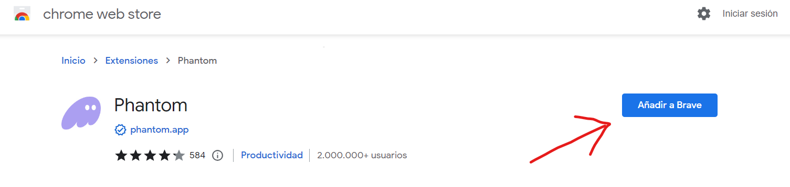

Para verificar la instalación damos clic en nuestras extensiones del navegador 

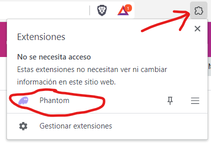

- Una vez instalada la extensión tenemos que crear una wallet, damos clic en la extensión de Phantom y se nos abrirá una ventana del navegador

- Damos clic en crear una nueva Billetera

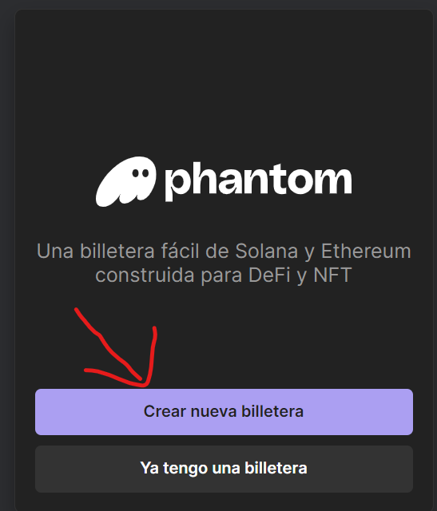

- Asignamos una contraseña nueva

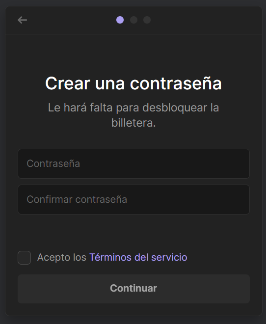

> IMPORTANTE para asegurar la billetera tenemos que guardar ya sea en una foto o en un archivo de texto la Fase Secreta de recuperación, es muy importante guardarla bien para que no se nos pierda la wallet  

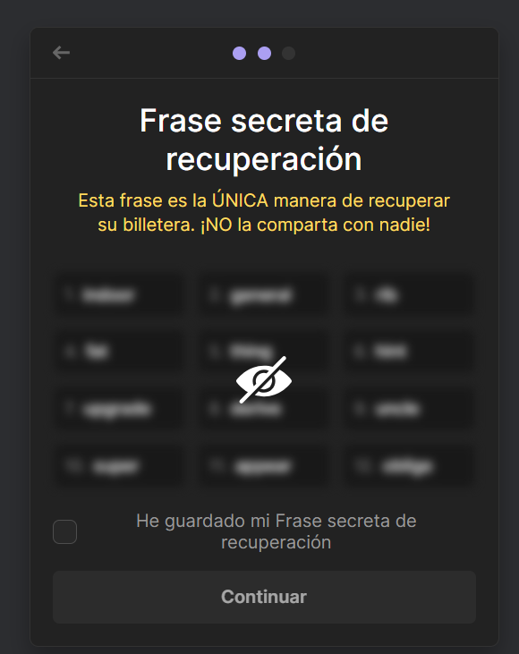

- Una vez guardada la frase de recuperación nos dará un mensaje de wallet creada exitosamente 

- A continuación damos clic de nuevo en la extensión de la wallet y se nos abrirá la interfaz de la wallet 

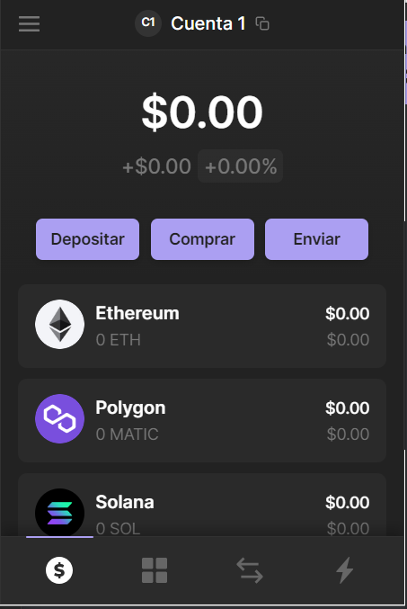

- Ya tenemos la wallet configurada ahora tenemos que cambiar a Modo Desarrollador para poder trabajar localmente con nuestro proyecto, para eso seguimos los siguientes pasos: 

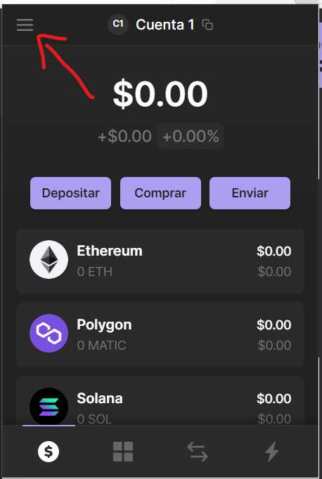

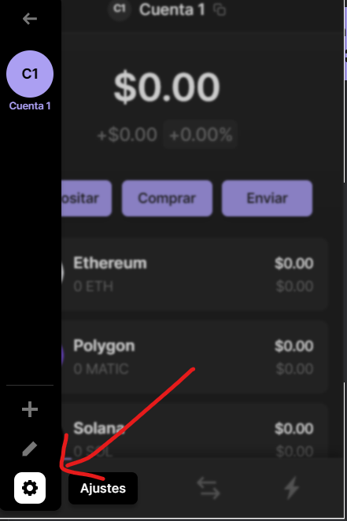

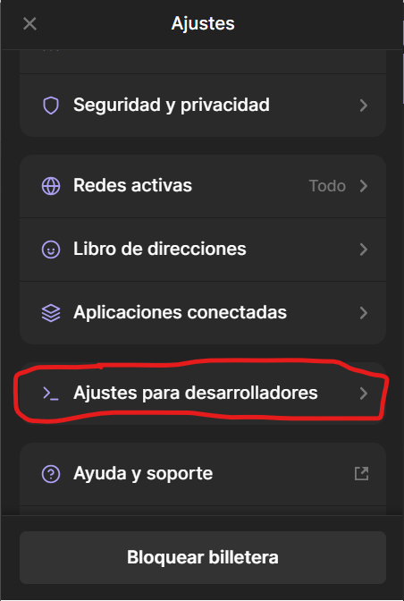

Activamos el modo testeo:

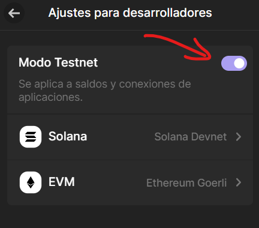

## Instalación de proyecto 

Ahora seguiremos con los pasos para instalar los paquetes y librerías necesarias para correr el proyecto localmente

Antes de instalar el proyecto tenemos que tener instalado NodeJs en nuestra computadora para ello se instala como cualquier programa en windows:

link de descarga: https://nodejs.org/es

Una vez descargado node utilizaremos un comando para instalar un paquete globalmente 

`npm i -g yarn`

Una vez instalado yarn ejecutaremos un comando dentro del proyecto de amiguitos visibles para ello podemos usar los comandos de navegación básicos en Windows (cd, ls)

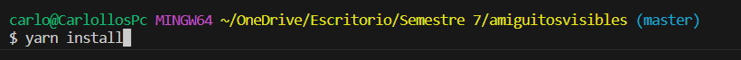

`yarn install`

Tardará un poco en instalar todos los paquetes que necesita el proyecto:

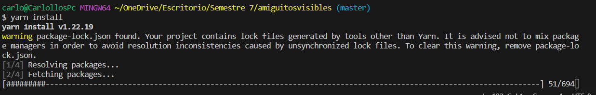

Una vez instalados todos los paquetes nos saldrá un mensaje 'Done' ahora ya podemos ejecutar el proyecto localmente :D

Usamos el comando:

`yarn run dev`

Nos saldrá un mensaje de 'ready' cuando el servidor ya está iniciado en nuestra computadora, copearemos la URL que tiene el localhost de nuestro proyecto y la pegaremos en un navegador, normalmente el servidor se corre en el URL: http://localhost:3000

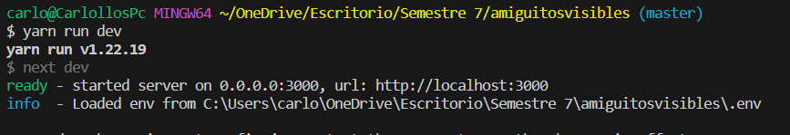

Una vez iniciado se nos abrirá una ventana emergente en el lado derecho del navegador que nos solicitara nuestra contraseña de la billetera de phantom: 

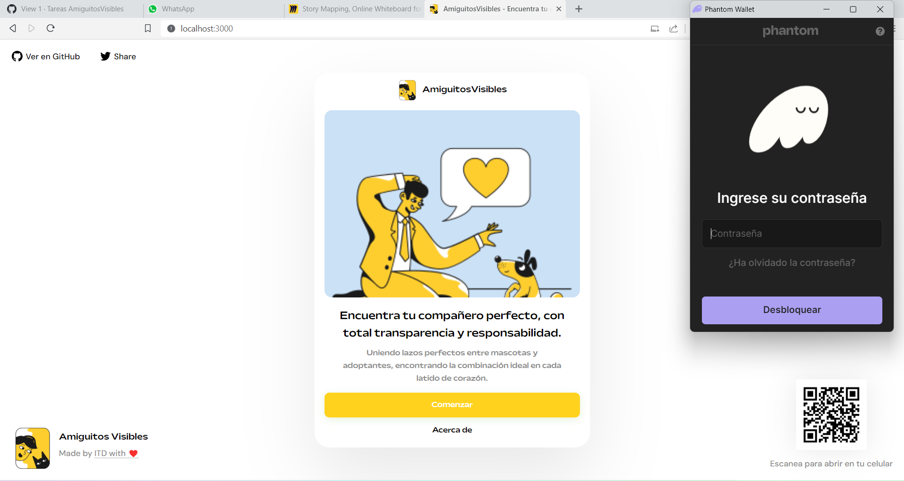

Una vez ingresada la contraseña nos pedirá que vinculemos nuestra cuenta con la aplicación de AmiguitosVisibles

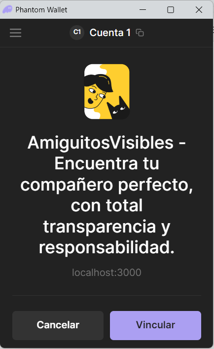

Y listo una vez vinculada nuestra wallet de phantom ya podemos usar las funciones de nuestra aplicación :D :tada: